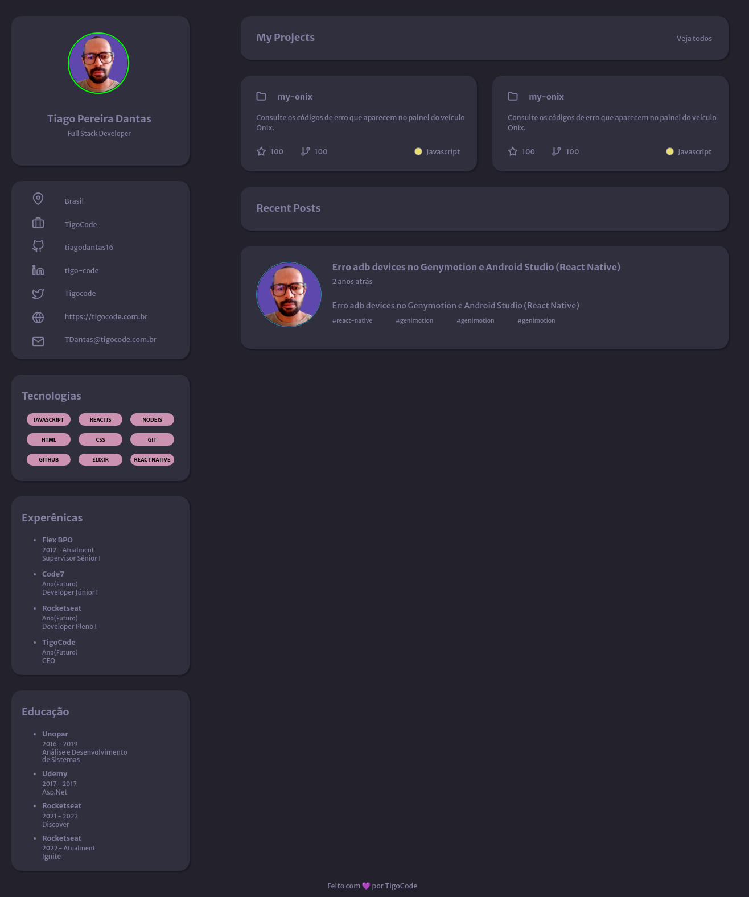

# Discorver Protfolio

> Trilha Discover

O Desafio Portfólio teve como finalidade criar uma pagina completa que é consta por uma header, aside, main e footer.

Cada seção apresenta uma informação sobre o Developer.

[ 🔗 Clique aqui para acessar](https://discover-portfolio.netlify.app)

## 🚀 Tecnologias

- HTML
- CSS
- Git e Github

## 🚀 Contato
TDantas@tigocode.com.br